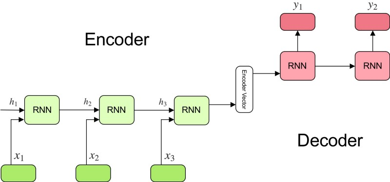
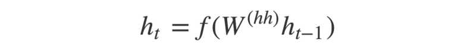
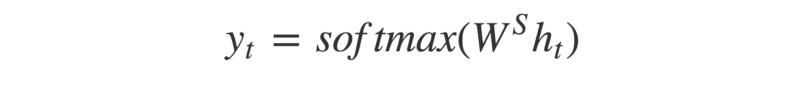

# Understanding Encoder-Decoder Sequence to Sequence Model

[link](https://towardsdatascience.com/understanding-encoder-decoder-sequence-to-sequence-model-679e04af4346)

## Definition of the Sequence to Sequence Model

A sequence to sequence model aims to map a fixed length input with a fixed length output where
the length of the input and output may differ.

## How the Sequence to Sequence Model works?

The model consists of 3 parts: encoder, intermediate (encoder) vector and decoder.

### Encoder

* A stack of several recurrent units (LSTM or GRU cells for better performance) where each
accepts a single element of the input sequence, collects information for that element and
propagates it forward.

* In question-answering problem, the input sequence is a collection of all words from the
question. Each word is represented as x_i where i is the order of that word.

* The hidden states h_i are computed using the formula:
    
    

This simple formula represents the result of an ordinary recurrent neural network. As you can
see, we just apply the appropriate weights to the previous hidden state h_(t-1) and the input
vector x_t.

### Encoder Vector

* This is the final hidden state produced from the encoder part of the model. It is calculated
using the formula above.

* This vector aims to encapsulate the information for all input elements in order to help the
decoder make accurate predictions.

* It acts as the initial hidden state of the decoder part of the model.

### Decoder

* A stack of several recurrent units where each predicts an output y_t at a time step t.

* Each recurrent unit accepts a hidden state from the previous unit and produces and output as
well as its own hidden state.

* In question-answering problem, the output sequence is a collection of all words from the answer.
Each word is represented as y_i where i is the order of that word.

* Any hidden state h_i is computed using the formula:

    

* The output y_t at time step t is computed using the formula:

    

We calculate the outputs using the hidden state at the current time step together with the 
respective weight W(S). Softmax is used to create a probability vector which will help us
determine the final output (e.g. word in the question-answering problem).

**The power of this model lies in the fact that it can map sequences of different lengths
to each other.** As you can see the inputs and outputs are not correlated and their lengths 
can differ. This opens a whole new range of problems which can now be solved using such 
architecture.

